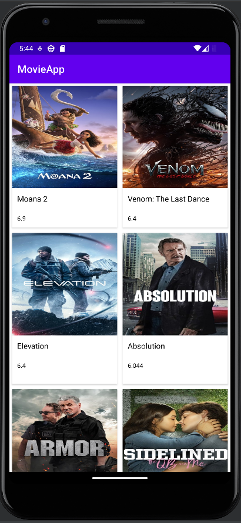

---

# Movie Rating App 🎥⭐

This app was created as a learning project to practice the **MVVM (Model-View-ViewModel)** architecture and explore working with **REST APIs** using **The Movie Database (TMDB)** API. It was developed during my pursuit of a **UDEMY Certification: [The Complete Android 15 Course (Part 1) - Master Java & Kotlin](https://www.udemy.com/)**.

---

| Main Feed |
| :---: |
|  |

## Features 🌟
- Fetches movie details and ratings from the TMDB API.
- Displays movie information in a clean and intuitive interface.

---

## Technologies Used 🧰
- **Programming Languages**: Java
- **Architecture**: MVVM (Model-View-ViewModel)
- **UI Components**: Android Views, RecyclerView
- **Data Fetching**: Retrofit (REST API)
- **Image Loading**: Glide
- **Build Tools**: Gradle
- **API**: The Movie Database (TMDB)

---

## 📜 License

- **Udemy Certification Materials**: The project was developed as part of the **[The Complete Android 15 Course (Part 1) - Master Java & Kotlin](https://www.udemy.com/)**. Any course-related material used in this app is subject to Udemy’s terms of use and intellectual property policies.  
- **TMDB API**: This app uses the **[TMDB API](https://www.themoviedb.org/documentation/api)** but is not endorsed or certified by TMDB. Please refer to the **[TMDB API Terms of Use](https://www.themoviedb.org/terms-of-use)** for compliance with their licensing and attribution requirements.

By using this project, you agree to respect the licenses of all tools, libraries, and services involved.

--- 

## Acknowledgments 👏
- **Udemy Course**: This app was developed as part of the **[The Complete Android 15 Course (Part 1)](https://www.udemy.com/)** by [Udemy Instructor Name].
- **TMDB API**: Thanks to **[The Movie Database (TMDB)](https://www.themoviedb.org/)** for providing an excellent API for movie data.
- **Open Source Libraries**:
  - **Retrofit** for seamless API integration.
  - **Glide** for efficient image loading.
  - **Jetpack Components** for modern Android development.

---
